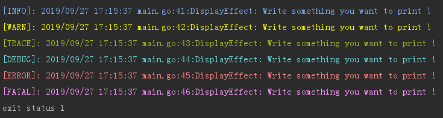

# golang日志小工具

[](https://travis-ci.org/corgi-kx)
<br>

花了几天时间写了个golang日志小工具，基本满足日常开发需求

**特点** 
 - 支持定向输出日志到指定文件  
 - 支持隐藏调试信息         
 - 支持彩色打印（windows/linux/mac均支持） 
 - 显示输出日志的类名、函数/方法名 
 
 <br>
 
 **Feature** 
  - Supports directing output logs to specified files
  - Support for hiding debugging information
  - Support color printing (Windows/Linux/MAC)
  - Displays the class name, function/method name of the output log
  
 <br>
 
**源码地址：**
[https://github.com/corgi-kx/logcustom](https://github.com/corgi-kx/logcustom)

<br>


### 示例 Example
<hr>

打印效果：

[](example/example.go)

[使用示范](example/example.go)：
```go
package main

import (
	log "github.com/corgi-kx/logcustom"
	"os"
)

func main() {
	//直接调用log，则是全局使用
	log.Info("Write something you want to print !")
	log.Warn("Write something you want to print !")
	log.Trace("Write something you want to print !")
	log.Debug("Write something you want to print !")
	log.Error("Write something you want to print !")

	//设置输出信息隐藏等级
	err := log.SetLogDiscardLevel(log.Leveldebug)
	if err != nil {
		log.Error(err)
	}

	log.Info("SetLogDiscardLevel test  !") //INFO不会被打印
	log.Debug("SetLogDiscardLevel test  !")
	log.Warn("SetLogDiscardLevel test  !")

	//创建新的日志对象
	mylog := log.New()
	file, err := os.OpenFile("log.txt", os.O_CREATE|os.O_APPEND|os.O_WRONLY, 0666)
	if err != nil {
		log.Error(err)
	}
	//将日志信息输出到指定文件
	mylog.SetOutputAbove(file, log.Levelwarn) //WARN及WARN以上级别的日志会输出到指定文件
	mylog.Trace("SetOutputAll test !")
	mylog.Info("SetOutputAll test  !")
	mylog.Debug("SetOutputAll test  !")
	mylog.Warn("SetOutputAll test  !")
	mylog.Error("SetOutputAll test  !")
}

```
<br><br>

### 安装 Installing
<hr>

```shell
go get github.com/corgi-kx/logcustom
```
安装成功后，日志包就可以使用了，包位置在
```shell
$GOPATH/src/github.com/corgi-kx/logcustom
```

您可以使用 `go get -u` 对此包进行更新
<br><br>

### 文档 Documentation
<hr>

您可以使用以下命令来查看使用文档
```shell
godoc github.com/corgi-kx/logcustom
```
或者在终端输入如下命令：
```shell
godoc -http=:6060
```
在浏览器访问此界面
```shell
http://127.0.0.1:6060/pkg/github.com/corgi-kx/logcustom/
```
